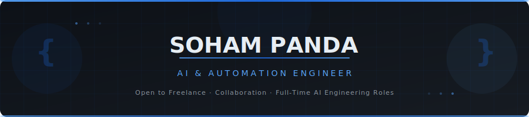

<!-- ═══════════════════════════════════════════════════════════════════════════ -->
<!--              SOHAM PANDA | AI & AUTOMATION ENGINEER                       -->
<!-- ═══════════════════════════════════════════════════════════════════════════ -->

<div align="center">



</div>

---

<div align="center">

[](https://git.io/typing-svg)

</div>

<br/>

<div align="center">

[](https://github.com/Soham-o)
[](https://www.linkedin.com/in/soham-panda-a90720336/)
[](mailto:sohampanda95599@gmail.com)

</div>

<div align="center">


</div>

---

## 🧠 Who Am I?

```python
class SohamPanda:
    """
    Aspiring AI & Automation Engineer — CS student who builds real,
    end-to-end systems rather than academic toy projects.
    Speciality: connecting multiple technologies into one solution
    that eliminates manual effort entirely.
    """

    def __init__(self):
        self.name        = "Soham Panda"
        self.role        = ["AI Engineer", "Automation Engineer", "Systems Builder"]
        self.location    = "India 🇮🇳"
        self.email       = "sohampanda95599@gmail.com"
        self.status      = "CS Student → Building in public"

        self.strengths   = [
            "Workflow automation",
            "AI agent development",
            "System integration",
            "Rapid self-teaching",
            "End-to-end product thinking",
        ]

        self.stack = {
            "language":     ["Python 🐍", "PowerShell", "Bash", "HTML/CSS/JS"],
            "ai_agents":    ["Voice AI", "LLM APIs", "Autonomous Agents"],
            "backend":      ["Flask", "Webhooks", "REST APIs", "Twilio"],
            "ml_cv":        ["TensorFlow", "Scikit-learn", "OpenCV", "Pandas"],
            "infra":        ["GCP", "Docker", "Git", "Linux", "Cloud Deployment"],
        }

        self.open_to     = [
            "Freelance AI / Automation projects",
            "Research collaborations",
            "Full-time AI Engineering roles",
        ]

    def philosophy(self) -> str:
        return "Automate everything. Build once. Let it run forever."

    def superpower(self) -> str:
        return "Taking ambitious ideas → working prototypes with minimal resources."
```

---

## ⚡ What I Build

<table width="100%" border="0" cellspacing="0" cellpadding="0">
<tr>

<td width="25%" align="center" valign="top">

**🤖 AI Agents**

Autonomous systems that perceive, decide, and act — without human hand-holding. From voice agents to multi-step reasoning pipelines.

</td>

<td width="25%" align="center" valign="top">

**⚙️ Automation Pipelines**

End-to-end workflows that replace hours of manual work. Newsletter digests, form processors, data extractors — set and forget.

</td>

<td width="25%" align="center" valign="top">

**🎙️ Voice AI**

Real-time conversational AI for calls, receptionists, and customer touchpoints. Built with Twilio, webhooks, and cloud-hosted voice models.

</td>

<td width="25%" align="center" valign="top">

**🔗 System Integration**

Connecting APIs, databases, webhooks, and services into one seamless backend. The glue that makes complex systems feel simple.

</td>

</tr>
</table>

---

## 🚀 Featured Projects

### 📞 PVCA 1.0 — Personal Voice Call Assistant

> **A fully autonomous AI receptionist. Near-zero cost. Fully cloud-hosted.**

An end-to-end voice AI system that handles inbound calls autonomously — no human needed. Built as a practical alternative to expensive enterprise call-centre software.

| Feature | Details |
|---|---|
| 📲 Missed call handling | Auto-triggers AI agent on missed calls |
| 🔀 Conditional forwarding | Routes calls based on caller data |
| 🎙️ AI voice interaction | Natural conversation via voice AI services |
| 📋 Caller data collection | Captures name, intent, contact info |
| 🔗 Webhook automation | Real-time event-driven backend triggers |
| ☁️ Cloud deployment | Always-on, zero-downtime hosting |

**Stack:**


---

### 📰 Automated News Digest System

> **One digest. All sources. Zero manual reading.**

A continuously running pipeline that collects newsletters and tech news from multiple sources, deduplicates, summarises, and delivers a clean digest — automatically.

- 🔄 Multi-source aggregation (RSS, newsletters, APIs)
- 🧠 AI-powered summarisation into concise digests
- 📬 Centralised delivery with minimal maintenance overhead
- ⏰ Scheduled execution — runs without intervention

**Stack:**


---

### 📄 Government Recruitment Form Processor

> **Structured data extraction at scale — from raw docs to clean spreadsheets.**

Built a workflow system for parsing and extracting structured information from complex government recruitment forms across multiple organisations, then auto-populating Excel sheets with validated data.

- 🔍 Document analysis & field detection
- 📊 Automated Excel population via Python
- 📐 Workflow standardisation across different form formats
- ✅ Data validation and error-checking layer

**Stack:**


---

### 🚗 Autonomous Driving Simulation

> **End-to-end AV pipeline: perception → decision → control.**

Explored and implemented a full autonomous driving pipeline covering the core AV problem stack — from sensor perception to vehicle actuation — tested inside a simulation environment.

- 👁️ Perception layer (object detection, lane recognition)
- 🧠 Decision making module (path planning, priority logic)
- 🕹️ Vehicle control (throttle, steering, braking)
- 🧪 Simulation-based testing and validation

**Stack:**


---

## 🛠️ Tech Stack

<div align="center">

### Core Languages


### AI / ML / Agents


### Backend & Integration


### Cloud & DevOps


</div>

---

## 📊 GitHub Analytics

<div align="center">


</div>

<div align="center">

<!-- streak-stats.demolab.com is more stable than the herokuapp version -->


</div>

---

## 🏆 Milestones & Achievements

<div align="center">

| 🗂️ Repositories | ⭐ Total Stars | 👥 Followers | 🔥 Contributions | 📅 Member Since |
|:---:|:---:|:---:|:---:|:---:|
| Check profile | Check profile | 41+ | 148+ | May 2024 |

</div>

<div align="center">


</div>

---

## 🔥 Contribution Activity

<div align="center">

[](https://github.com/ashutosh00710/github-readme-activity-graph)

</div>

---

## 🎯 Career Focus

```
AI Engineering       ████████████████████  Primary
Automation Eng.      ██████████████████░░  Primary  
MLOps                ████████████████░░░░  Growing
Intelligent Agents   ███████████████████░  Primary
Backend Dev          ██████████████░░░░░░  Supporting
Applied AI / R&D     ████████████░░░░░░░░  Exploring
```

---

## 🤝 Let's Build Something That Actually Works

> *"I don't just write code — I build systems that replace manual effort permanently.  
> If it can be automated, it should be."*

<div align="center">

I'm open to **freelance AI/Automation projects**, **collaborations**, and **full-time AI Engineering roles**.

If you have a repetitive problem, a process that wastes time, or an idea that needs an AI backbone — let's talk.

<br/>

[](mailto:sohampanda95599@gmail.com)
[](https://www.linkedin.com/in/soham-panda-a90720336/)

</div>

---

<div align="center">


</div>
